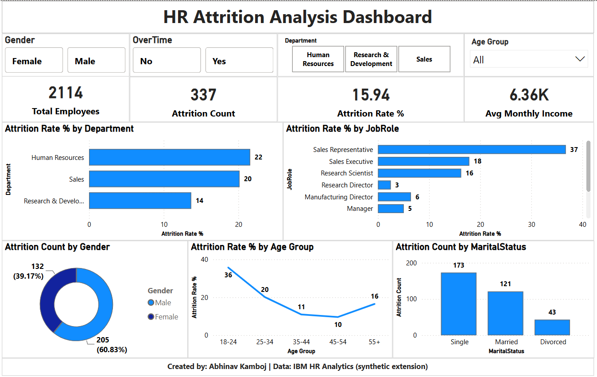
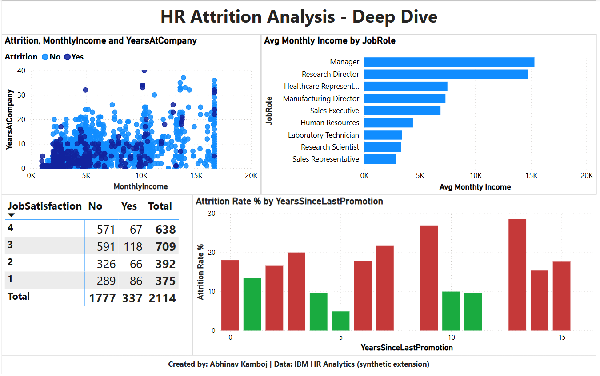

# HR-Attrition-Analysis

End-to-end HR Attrition Analysis using Python, SQL Server, and Power BI.

## Project Overview

This project analyzes employee attrition patterns using a synthetically extended version of the IBM HR Analytics dataset (2,114 cleaned records).
It demonstrates a complete, real-world data pipeline — from raw data cleaning in Python, through storage and analysis in SQL Server, to an interactive Power BI dashboard connected live to the database.

## Data Pipeline

Raw CSV (unclean, 2,208 rows)

↓

Python (Pandas, NumPy)

↓

Cleaned Dataset (2,114 rows, 0 missing values)

↓

Python (SQLAlchemy + pyodbc)

↓

SQL Server / SSMS (storage + analysis)

↓ Live connection

Power BI Dashboard (interactive, 2 pages)

## Tools & Technologies

- **Python** — Pandas, NumPy (data cleaning), Matplotlib, Seaborn (outlier detection, and visualization), SQLAlchemy + pyodbc (SQL Server integration)
- **SQL Server (SSMS)** — Data storage and analytical queries
- **Power BI Desktop** — Interactive dashboard, DAX measures, live SQL Server connection

- **Jupyter Notebook** — Data cleaning and preparation

## Repository Structure

HR-Attrition-Analysis/
├── PowerBI/
│   ├── HR_Project_Dashboard.pbix
│   ├── Dashboard_Overview.png
│   └── Dashboard_DeepDive.png
├── Python/
│   └── HR_Attrition_Data_Cleaning.ipynb
├── SQL/
│   └── HR_Attrition_SQL_Analysis.sql
├── data/
│   ├── HR_Attrition_UNCLEAN.csv
│   └── HR_Attrition_CLEANED.csv
└── README.md

## 1. Data Cleaning (Python)

Performed in Jupyter Notebook (`Python/HR_Attrition_Data_Cleaning.ipynb`):

- **Duplicate removal:** Exact duplicate rows and EmployeeNumber-based duplicates
- **Missing value handling:** Median imputation for numeric columns and mode imputation for categorical columns
- **Outlier treatment:**
  - Invalid Age values (<18 or >60) marked as missing and imputed
  - MonthlyIncome extreme values capped using the IQR method
  - Other IQR-flagged outliers (PerformanceRating, YearsAtCompany) retained as legitimate business variation
- **Text standardization:** Fixed inconsistent casing and whitespace
- **Data type correction:** Removed constant/useless columns (EmployeeCount, Over18, StandardHours)

**Result:** 2,208 raw rows → 2,114 clean rows, 32 columns, 0 missing values

## 2. Loading into SQL Server

The cleaned dataset was loaded directly into SQL Server using Python (within `Python/HR_Attrition_Data_Cleaning.ipynb`) via SQLAlchemy, avoiding manual import tools and enabling a repeatable and automated pipeline.

## 3. SQL Analysis (SSMS)

Analytical queries (`SQL/HR_Attrition_SQL_Analysis.sql`) covering:

- Overall attrition rate
- Attrition by Department, JobRole, Gender, Age Group, OverTime, and Marital Status
- Salary and tenure comparisons
- Department ranking using window functions
- High-risk employee identification based on low satisfaction and overtime

## 4. Power BI Dashboard

Power BI Desktop connects to SQL Server as the primary data source for the dashboard.

### Page 1 — Overview

- KPI Cards:
  - Total Employees
  - Attrition Count
  - Attrition Rate %
  - Average Monthly Income
- Attrition Rate % by Department and JobRole
- Attrition breakdown by Gender, Age Group, and Marital Status
- Interactive slicers:
  - Gender
  - OverTime
  - Department
  - Age Group

### Page 2 — Deep Dive

- Scatter plot: Monthly Income vs Years at Company
- Average Monthly Income by JobRole
- Job Satisfaction Matrix
- Attrition Rate % by Years Since Last Promotion

## Key Insights

- **Overall attrition rate:** 15.94%
- **Highest-risk role:** Sales Representative — 37% attrition rate (verified via SQL, sample size of 117 employees)
- **Age group 18–24** shows the highest attrition rate (~36%)
- Employees working overtime have significantly higher attrition
- Lower job satisfaction (1–2) is associated with a higher share of attrition
- Longer gaps since last promotion (10+ years) correlate with elevated attrition risk

## Recommendations

Based on the analysis, the following actions could help reduce employee attrition:

- Prioritize retention initiatives for Sales roles and employees who frequently work overtime
- Investigate engagement, onboarding, and career development opportunities for early-career employees aged 18–24
- Review promotion and career progression opportunities for long-tenured employees who have not received a promotion recently
- Monitor employee satisfaction levels and identify teams or roles with consistently low satisfaction
- Use attrition trends by department and job role to support targeted retention planning

## Dashboard Screenshots

### Overview Page

### Deep Dive Page

## Data Note

The dataset used is a synthetically extended version of the IBM HR Analytics dataset. Missing values, duplicates, and inconsistencies were intentionally introduced to simulate a realistic, messy data-cleaning and analysis scenario.

## Project Objective

The primary objective of this project is to demonstrate an end-to-end **Data Analyst workflow** involving:

Data Cleaning → Data Preparation → SQL Server Storage → SQL Analysis → Power BI Visualization → Business Insights → Recommendations

This project showcases practical skills in **Python, SQL, Power BI, data cleaning, exploratory analysis, data visualization, and business insight generation**.

## Author

**Abhinav Kamboj**

Python | SQL | SQL Server | Power BI | DAX | Pandas | NumPy | Matplotlib | Seaborn | Data Cleaning | Data Visualization
